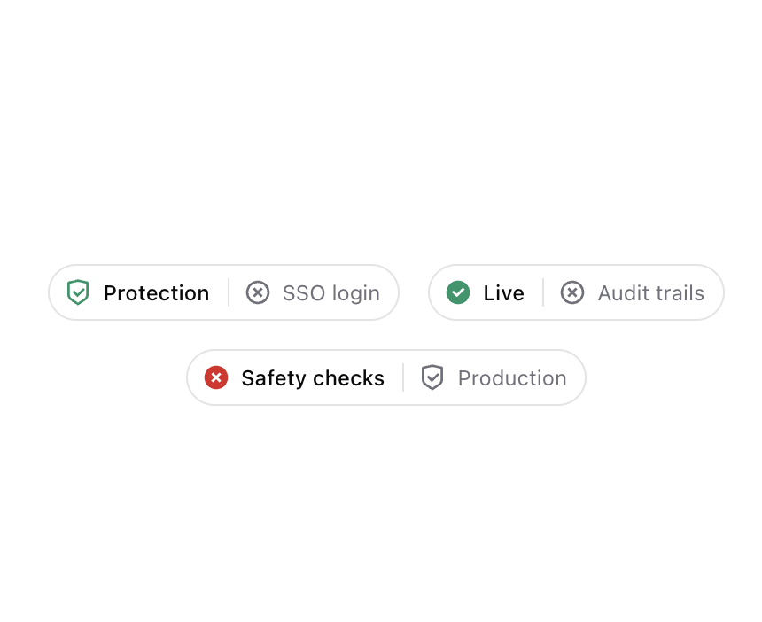

# Composant « Status Badge » (21st.dev, @serafimcloud)

> Source : https://21st.dev/@serafimcloud/components/status-badge — récupéré le 2026-09-26
> Licence **MIT** · description « Status Badge inspired by Tremor » · registre `ui` · créé 2025-01-22
> **Code RÉEL**, pas une reconstitution : le fichier source est servi en clair par le CDN public
> `https://cdn.21st.dev/user_2nElBLvklOKlAURm6W1PTu6yYFh/status-badge/code.tsx` (aucun compte requis).

| Fichier local | Origine CDN |
| --- | --- |
| `source/status-badge.tsx` | `.../status-badge/code.tsx` (composant) |
| `source/status-badge.demo.tsx` | `.../status-badge/default/code.demo.tsx?v=1` (démo) |
| `source/tailwind.config.js` | `.../status-badge/tailwind.config.js` (jetons Tremor) |
| `source/compiled.css` | `.../status-badge/default/compiled.css` (CSS Tailwind compilé de la démo, variables shadcn) |
| `preview.png` | `.../status-badge/default/preview.png?v=1` |
| (non gardé) | bundle `https://cdn.21st.dev/bundled/521.html` (330 Ko, rendu compilé de la démo) |



## Dépendances

- npm : `@remixicon/react` (icônes, type `IconType`), `class-variance-authority` (cva) — déclarées « latest » par 21st.dev
- shadcn : `cn()` de `@/lib/utils` (clsx + tailwind-merge) ; jetons CSS shadcn `bg-background`, `text-foreground`,
  `text-muted-foreground`, `bg-border`, `border`
- Tailwind : 3 jetons « Tremor » ajoutés par `tailwind.config.js` :
  `rounded-tremor-full` = `9999px`, `text-tremor-label` = `0.75rem` (+ `tremor-default` 0.5rem, `tremor-small` 0.375rem, inutilisés ici)
- Pas de lucide-react dans l'original (Remix Icon).

## Props

| Prop | Type | Requis | Rôle |
| --- | --- | --- | --- |
| `status` | `"success" \| "error" \| "default"` | non (défaut `default`) | colore **uniquement l'icône de gauche** : emerald-600 (dark : emerald-500) / red-600 (dark : red-500) / couleur du texte |
| `leftIcon` | `IconType` (composant icône) | non | icône avant `leftLabel` |
| `leftLabel` | `string` | oui | libellé principal (font-medium, `text-foreground`) |
| `rightIcon` | `IconType` | non | icône avant `rightLabel` (toujours grise) |
| `rightLabel` | `string` | oui | libellé secondaire (`text-muted-foreground`) |
| `className`, `...props` | `HTMLAttributes<HTMLSpanElement>` | non | fusionnés sur le `<span>` racine |

Variantes : **seulement 3** (`success`, `error`, `default`). Les entrées cva sont vides — la couleur est
appliquée par des conditions dans le JSX, pas par cva. **Pas de `warning`** : à ajouter soi-même (voir adaptation).

Structure : pilule (`rounded-full`, bordure, fond `background`, `px-2.5 py-1.5`, texte 12 px) = [icône colorée + label gras]
| séparateur vertical 1 px × 16 px | [icône grise + label atténué].

## Code source original (`source/status-badge.tsx`)

```tsx
import * as React from "react"
import { cva, type VariantProps } from "class-variance-authority"
import { cn } from "@/lib/utils"
import { IconType } from "@remixicon/react"

const statusBadgeVariants = cva(
  "inline-flex items-center gap-x-2.5 rounded-tremor-full bg-background px-2.5 py-1.5 text-tremor-label border",
  {
    variants: {
      status: {
        success: "",
        error: "",
        default: "",
      },
    },
    defaultVariants: {
      status: "default",
    },
  }
)

interface StatusBadgeProps
  extends React.HTMLAttributes<HTMLSpanElement>,
    VariantProps<typeof statusBadgeVariants> {
  leftIcon?: IconType
  rightIcon?: IconType
  leftLabel: string
  rightLabel: string
}

export function StatusBadge({
  className,
  status,
  leftIcon: LeftIcon,
  rightIcon: RightIcon,
  leftLabel,
  rightLabel,
  ...props
}: StatusBadgeProps) {
  return (
    <span className={cn(statusBadgeVariants({ status }), className)} {...props}>
      <span className="inline-flex items-center gap-1.5 font-medium text-foreground">
        {LeftIcon && (
          <LeftIcon 
            className={cn(
              "-ml-0.5 size-4 shrink-0",
              status === "success" && "text-emerald-600 dark:text-emerald-500",
              status === "error" && "text-red-600 dark:text-red-500"
            )} 
            aria-hidden={true}
          />
        )}
        {leftLabel}
      </span>
      <span className="h-4 w-px bg-border" />
      <span className="inline-flex items-center gap-1.5 text-muted-foreground">
        {RightIcon && (
          <RightIcon 
            className="-ml-0.5 size-4 shrink-0" 
            aria-hidden={true}
          />
        )}
        {rightLabel}
      </span>
    </span>
  )
}
```

## Démo originale (`source/status-badge.demo.tsx`)

```tsx
import { StatusBadge } from "@/components/ui/status-badge"
import { RiCheckboxCircleFill, RiCloseCircleFill, RiCloseCircleLine, RiShieldCheckLine } from '@remixicon/react'

export function StatusBadgeDemo() {
  return (
    <div className="flex flex-wrap justify-center gap-4">
      <StatusBadge leftIcon={RiShieldCheckLine} rightIcon={RiCloseCircleLine}
        leftLabel="Protection" rightLabel="SSO login" status="success" />
      <StatusBadge leftIcon={RiCheckboxCircleFill} rightIcon={RiCloseCircleLine}
        leftLabel="Live" rightLabel="Audit trails" status="success" />
      <StatusBadge leftIcon={RiCloseCircleFill} rightIcon={RiShieldCheckLine}
        leftLabel="Safety checks" rightLabel="Production" status="error" />
    </div>
  )
}
```

## Adaptation pour Cheffer (genesis-ui) — NON testée, à compiler dans `.next-verify` d'abord

Constat le 2026-09-26 dans `/home/autoblog/genesis-ui/package.json` : Next 16, React 19, **Tailwind v4**,
`lucide-react`, `class-variance-authority`, `clsx`, `tailwind-merge`, `src/lib/utils.ts` présents ;
`@remixicon/react` **absent**. Donc :

1. Tailwind v4 n'utilise pas `tailwind.config.js` → remplacer `rounded-tremor-full` par `rounded-full`
   et `text-tremor-label` par `text-xs` (mêmes valeurs : 9999px / 0.75rem), ou déclarer dans le CSS global
   `@theme { --radius-tremor-full: 9999px; --text-tremor-label: 0.75rem; }`.
2. Icônes : `LucideIcon` au lieu de `IconType` (pas de nouvelle dépendance).
3. Ajouter `warning` (ambre) et `unknown` (gris) pour les états HetrixTools (maintenance, pas de données).

```tsx
import * as React from "react"
import type { LucideIcon } from "lucide-react"
import { cn } from "@/lib/utils"

type Status = "success" | "error" | "warning" | "default"

const iconColor: Record<Status, string> = {
  success: "text-emerald-600 dark:text-emerald-500",
  error: "text-red-600 dark:text-red-500",
  warning: "text-amber-600 dark:text-amber-500",
  default: "",
}

interface StatusBadgeProps extends React.HTMLAttributes<HTMLSpanElement> {
  status?: Status
  leftIcon?: LucideIcon
  rightIcon?: LucideIcon
  leftLabel: string
  rightLabel: string
}

export function StatusBadge({ className, status = "default", leftIcon: LeftIcon,
  rightIcon: RightIcon, leftLabel, rightLabel, ...props }: StatusBadgeProps) {
  return (
    <span className={cn("inline-flex items-center gap-x-2.5 rounded-full border bg-background px-2.5 py-1.5 text-xs", className)} {...props}>
      <span className="inline-flex items-center gap-1.5 font-medium text-foreground">
        {LeftIcon && <LeftIcon className={cn("-ml-0.5 size-4 shrink-0", iconColor[status])} aria-hidden />}
        {leftLabel}
      </span>
      <span className="h-4 w-px bg-border" />
      <span className="inline-flex items-center gap-1.5 text-muted-foreground">
        {RightIcon && <RightIcon className="-ml-0.5 size-4 shrink-0" aria-hidden />}
        {rightLabel}
      </span>
    </span>
  )
}
```

Correspondance HetrixTools → badge (voir SKILL.md § « Pour la home ») :

| HetrixTools (`GET /v3/uptime-monitors`) | `status` | icône gauche (lucide) | `leftLabel` | `rightLabel` (exemple) |
| --- | --- | --- | --- | --- |
| `uptime_status=up`, `monitor_status=active` | success | `CircleCheck` | nom du service | `142 ms · 99,98 %` |
| `uptime_status=down`, `monitor_status=active` | error | `CircleX` | nom du service | `KO depuis 12 min` |
| `monitor_status` = `maint` / `maint_dnd` | warning | `Wrench` | nom du service | `Maintenance` |
| `paused` / `disabled`, ou cache périmé / API injoignable | default | `CircleHelp` | nom du service | `Pas de données` |

Accessibilité : la couleur seule ne suffit pas ; le libellé de droite dit l'état en toutes lettres,
et on peut ajouter `role="status"` + `aria-label="Cheffer : en ligne"` sur la racine.
