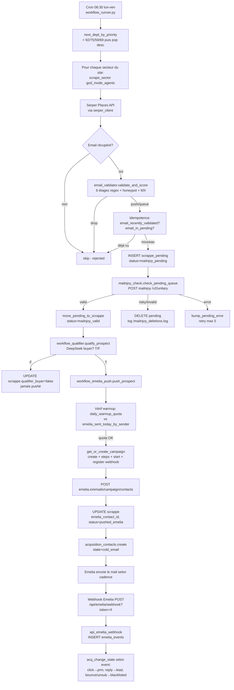
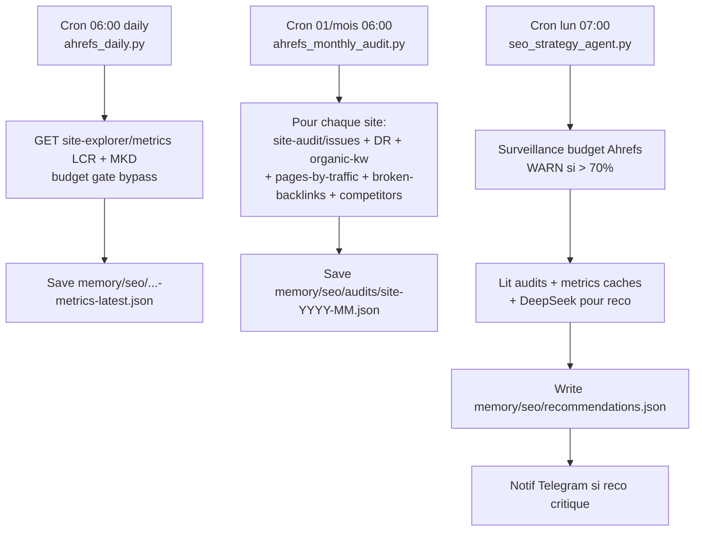
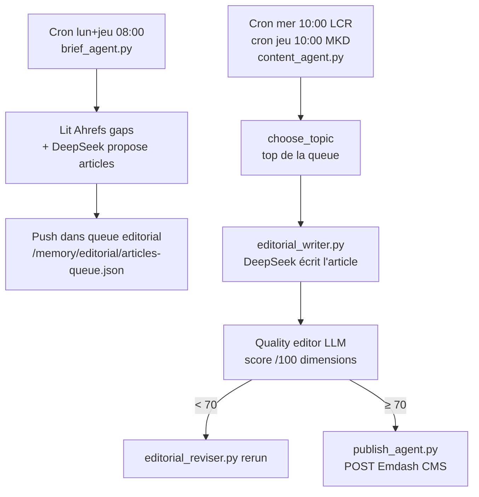
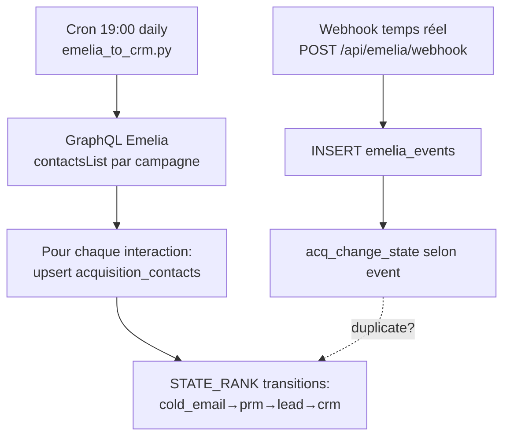
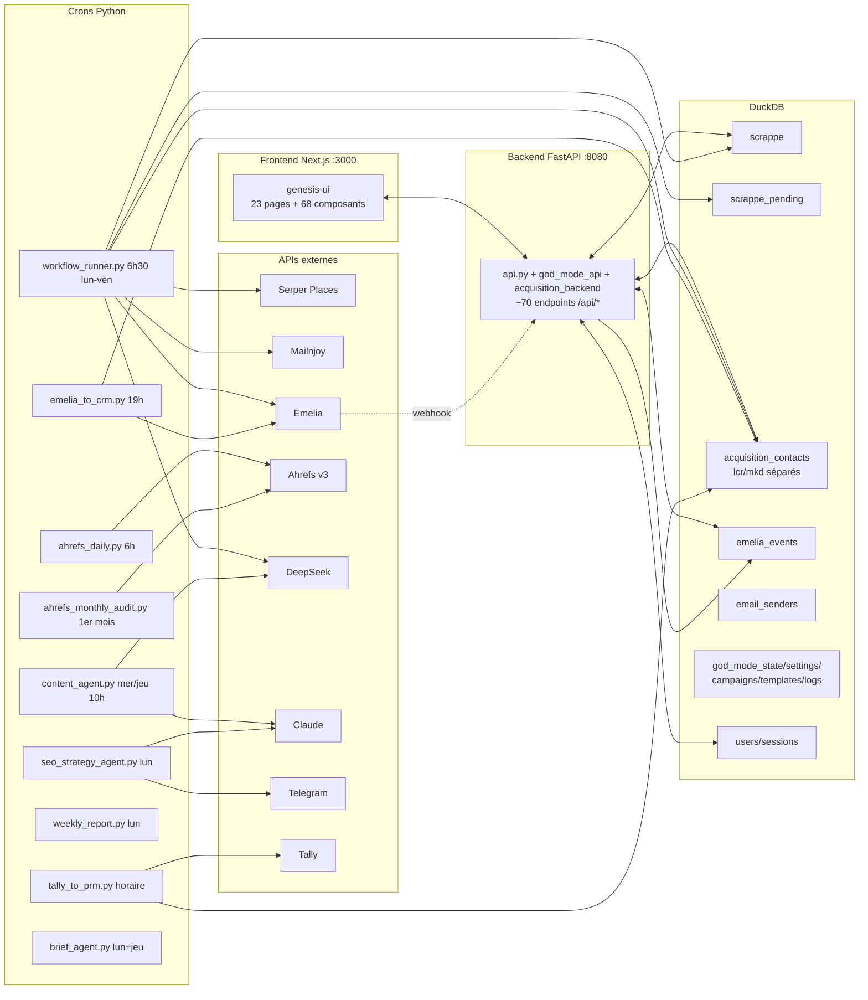

# ARCHITECTURE — Genesis

> Audit complet du projet, rédigé le 2026-05-22 avant le Chantier 2 (refonte UI + déduplication). Aucun code n'est modifié tant que ce document n'est pas validé.

---

## 0. Vue d'ensemble (1 paragraphe)

Genesis est une plateforme Python (FastAPI + DuckDB) + Next.js qui automatise la prospection cold email pour 2 sites cibles (**LCR** = leclientroi.com, **MKD** = mkdgroupe.com). Le pipeline opérationnel est : **Serper** (scrape Google Places) → **email_validator** (regex + honeypot RGPD) → **scrappe_pending** (table de quarantaine) → **Mailnjoy** (vérification délivrabilité) → **scrappe** (status `mailnjoy_valid`) → **DeepSeek qualifier** (verdict buyer/non-buyer) → **Emelia** (push contact + start campagne) → **webhook Emelia** push event SENT/OPENED/CLICKED/REPLIED/BOUNCED/UNSUBSCRIBED → **acquisition_contacts** (CRM). En parallèle, un module **SEO Ahrefs** (cron daily + monthly audit + Strategist agent) génère des recommandations, un module **Editorial** (brief_agent → content_agent → publish_agent) écrit et publie des articles, et une **UI Next.js + shadcn** présente tout ça.

---

## 1. Catalogue des services backend (49 modules Python dans `scripts/`)

### 1.1 Hub central
| Module | Rôle 1 ligne | Tables écrites | Trigger |
|---|---|---|---|
| `api.py` | FastAPI main — expose **~70 endpoints /api/\*** au frontend | emelia_events (insert) | uvicorn (PM2 genesis-dashboard) |
| `auth_backend.py` | User/role/session (bcrypt + TOTP + audit logs) | users, sessions, login_logs | Bearer middleware |
| `cost_tracker.py` | Log + bill (Anthropic, Ahrefs, Serper) + gate budget Ahrefs | costs-log.json (file) | partout |
| `llm_call.py` | Wrapper Claude (caching, costing) | (via cost_tracker) | Tous les agents IA |
| `modules_backend.py` | Feature flags par module et par site | (JSON config) | content_agent, llm_call |
| `sites_config.py` | Registry sites (LCR, MKD) | — | partout |

### 1.2 Scrape & qualification (workflow LCR)
| Module | Rôle | Tables écrites | Trigger |
|---|---|---|---|
| `god_mode_backend.py` | **HUB orchestration** — scrappe + scrappe_pending + campaigns + state + settings + logs + templates | scrappe, scrappe_pending, god_mode_state, god_mode_settings, god_mode_campaigns, god_mode_templates, god_mode_logs, **email_senders**, **emelia_events**, **email_recently_validated/in_pending helpers** | god_mode_api, workflow_runner |
| `god_mode_api.py` | FastAPI router `/api/god-mode/*` | (via god_mode_backend) | Bearer middleware |
| `god_mode_agents.py` | `scrape_sector(site, sector)` — scrape Serper + email_validator + insert scrappe_pending + idempotence | scrappe_pending | workflow_runner |
| `god_mode_scheduler.py` | Valide + planifie une campagne (compte prospects par dept+secteur) | god_mode_campaigns | god_mode_api |
| `god_mode_templates.py` | Génération templates email via DeepSeek (sujet + body HTML) | god_mode_templates | god_mode_api |
| `workflow_geo.py` | Régions/dépts/villes FR + `next_dept_by_priority()` (rotation 92/75/59/69+) | (JSON data/geo/*) | workflow_runner |
| `workflow_runner.py` | **Orchestrateur cron** — pour chaque secteur : scrape → qualify → push Emelia → drain Mailnjoy | (via les autres) | **cron `30 6 * * 1-5`** |
| `workflow_qualifier.py` | DeepSeek qualifier (`qualifier_buyer = True/False`) | scrappe (update) | workflow_runner |
| `prospect_scraper.py` | Scraper Serper Places autonome (CLI) | scrappe | manuel uniquement |

### 1.3 Email validation
| Module | Rôle | Tables | Trigger |
|---|---|---|---|
| `email_validator.py` | 6 étages : normalisation, regex, hard rejects honeypot/forbidden_tld/role/disposable, MX check, RGPD, scoring 0-100 | — | `god_mode_agents.scrape_sector()` |
| `mailnjoy_check.py` | Module Mailnjoy : check_email + classify + check_pending_queue (drain) + budget guard | scrappe (via move), scrappe_pending (via delete) | workflow_runner (après scrape) |

### 1.4 Emelia push
| Module | Rôle | Tables écrites | Trigger |
|---|---|---|---|
| `workflow_emelia_push.py` | `push_prospect(site, prospect_id)` → crée/utilise campagne, configure steps, démarre, ajoute contact, **enregistre webhook auto**, **respecte warmup quota** | scrappe (update emelia_contact_id, status=pushed_emelia), acquisition_contacts (cold_email) | workflow_runner |
| `emelia_campaign_manager.py` | CRUD campagnes Emelia (create, list, configure_steps, configure_settings, add_contact, stats, get_default_steps par secteur) | (Emelia API uniquement) | api, workflow_emelia_push |
| `emelia_to_crm.py` | Cron quotidien — sync Emelia GraphQL → acquisition_contacts (state transitions cold_email→prm→lead→crm) | acquisition_contacts | **cron 19h UTC** |
| `acquisition_backend.py` | CRUD acquisition_contacts (find_by_email, create, change_state, blacklist, bulk_import, stats) | acquisition_contacts | api, emelia_to_crm, workflow_emelia_push, tally_to_prm, webhook handler |

### 1.5 SEO / Ahrefs
| Module | Rôle | Coût | Trigger |
|---|---|---|---|
| `ahrefs_daily.py` | Daily metrics minimaliste (1 endpoint = `site-explorer/metrics`) | ~100u/jour × 2 sites | **cron `0 6 * * *`** |
| `ahrefs_monthly_audit.py` | Audit complet mensuel (site-audit/issues + Tier 1+2 endpoints) | ~700u/site/mois | **cron `0 6 1 * *`** |
| `seo.py` | CLI query générique Ahrefs (keywords-explorer, serp-overview, rank-tracker) | variable | manuel (anciennement bouton UI, désactivé) |
| `seo_strategy_agent.py` | DeepSeek transforme audit Ahrefs → recommandations + **surveillance budget** | ~0.05€ | **cron lundi 7h** |
| `seo_agent.py` | RSS directories + submission tracking | ~0.02€ | cron 5h UTC |
| `competitor_analyzer.py`, `competitor_seo_analyzer.py` | Analyse concurrents on-demand | ~50-100u/run | manuel |

### 1.6 Content / Editorial
| Module | Rôle | Trigger |
|---|---|---|
| `editorial_api.py` | Queue articles (CRUD JSON) | endpoints `/api/editorial/*` |
| `editorial_writer.py` | LLM écriture article (DeepSeek) | manuel + content_agent |
| `editorial_reviser.py` | LLM révision article | manuel |
| `brief_agent.py` | Propose articles d'après gaps Ahrefs | **cron lun+jeu 8h** |
| `content_agent.py` | choose_topic → generate_article → publish | **cron mer 10h LCR, jeu 10h MKD** |
| `publish_agent.py` | Markdown → Emdash/WordPress | manuel |
| `internal_linking_agent.py` | Suggestions liens internes | manuel |

### 1.7 Misc
| Module | Rôle | Trigger |
|---|---|---|
| `briefing.py` | Rapport Telegram matinal | cron 7h |
| `tally_to_prm.py` | Sync Tally forms → acquisition_contacts | **cron `10 * * * *`** (toutes les heures) |
| `tally_client.py` | Wrapper Tally API | tally_to_prm |
| `serper_client.py` | Wrapper Serper API | scrape, content_agent |
| `linkedin_agent.py` | Post LinkedIn (Haiku) | cron 10h UTC |
| `weekly_report.py` | Rapport hebdo leads non contactés | **cron lun 6h** |
| `indexation_agent.py`, `health_check.py`, `infographic.py`, `onboarding_agent.py`, `generate_images.py`, `rag_query.py`, `rag_writer.py`, `campaign_manager.py` | Outils / utilitaires manuels | manuel |

### 1.8 Crons actifs (résumé)
```
30 6 * * 1-5  workflow_runner.py            # scrape + push prospects
 0 6 * * *    ahrefs_daily.py               # metrics
 0 6 1 * *    ahrefs_monthly_audit.py       # audit complet
 0 7 * * 1    seo_strategy_agent.py         # reco + surveillance budget
 0 8 * * 1,4  brief_agent.py                # propose articles
 0 10 * * 3   content_agent.py --site lcr   # publication article
 0 10 * * 4   content_agent.py --site mkd
 0 10 * * *   linkedin_agent.py
 0 19 * * *   emelia_to_crm.py              # sync interactions
 0 6 * * 1    weekly_report.py
10 * * * *    tally_to_prm.py               # heure pleine + 10min
```

---

## 2. Catalogue des pages frontend (23 pages Next.js + 68 composants)

### 2.1 Pages globales (root level)
| URL | Fichier | Lignes | Rôle |
|---|---|---|---|
| `/login` | `app/login/page.tsx` | 121 | Auth (login + MFA) |
| `/dashboard` | `app/dashboard/page.tsx` | 55 | Dashboard global superadmin |
| `/costs` | `app/costs/page.tsx` | **421** | Matrice coûts (par site/modèle/jour) |
| `/security` | `app/security/page.tsx` | 170 | MFA setup |
| `/view` | `app/view/page.tsx` | 206 | Vue multi-sites comparée |
| `/campaigns` | `app/campaigns/page.tsx` | **732 ⚠️** | Builder campagne Emelia (6 étapes) |
| `/onboarding` | `app/onboarding/page.tsx` | 233 | Créer un nouveau site |
| `/versions` | `app/versions/page.tsx` | 181 | Historique versions |

### 2.2 Pages site (`/site/[code]/*`)
| URL | Lignes | Rôle | Endpoints |
|---|---|---|---|
| `/site/[code]/dashboard` | 213 | Dashboard site | `god-mode/{site}/stats`, `editorial/queue` |
| `/site/[code]/seo` | 91 | Analyse SEO Ahrefs | `/api/seo`, `/api/seo-ahrefs/{site}`, `/api/seo/credits-log` |
| `/site/[code]/seo-strategy` | 203 | Générateur stratégie SEO | `/api/seo-strategy/{site}` |
| `/site/[code]/agents` | 131 | Gestion agents IA | `/api/agents/{site}` |
| `/site/[code]/articles` | 269 | Queue éditoriale + édition | `/api/editorial/*` |
| `/site/[code]/acquisition` | **457 ⚠️** | **CRM prospects** (cold_email, prm, lead, crm, blacklisted) | `/api/sites/{site}/acquisition` |
| `/site/[code]/setup` | **416 ⚠️** | API keys + users + webhooks + Mailnjoy config | `/api/sites/{site}/api-keys`, `/api/auth/users` |

### 2.3 Pages workflow (`/site/[code]/workflow/*`)
| URL | Rôle |
|---|---|
| `/site/[code]/workflow` (197) | Overview compteurs (Scrapés/Nettoyés/Envoyés) + chart |
| `/site/[code]/workflow/performance` | Funnel par secteur + par ville |
| `/site/[code]/workflow/templates` | CRUD templates email par secteur (lock/unlock/edit) |
| `/site/[code]/workflow/prospects` | **Liste prospects table `scrappe`** (filtre status/sector, recherche, pagination) |
| `/site/[code]/workflow/campaigns` | Campagnes Emelia du workflow |
| `/site/[code]/workflow/logs` | Logs exécution workflow |

### 2.4 Composants > 100 lignes
| Composant | Lignes | Rôle |
|---|---|---|
| `app-sidebar.tsx` | 268 | **Navigation principale**, filtrage par module, widget budget par site |
| `modules-grid.tsx` | 265 | Sélecteur modules activés par site |
| `article-image-uploader.tsx` | 215 | Upload Unsplash + custom |
| `article-editor.tsx` | 202 | Éditeur markdown |
| `site-budget-card.tsx` | 148 | Card budget LLM/API par site (refondu Chantier 3) |
| `nav-main.tsx` | 138 | Rendu items sidebar |
| `site-logo-upload.tsx` | 134 | Upload logo |
| `connector-alerts.tsx` | 120 | Alertes connecteurs |
| `mailnjoy-config-card.tsx` | 119 | Configuration Mailnjoy (créé aujourd'hui) |
| `nav-user.tsx` | 112 | Menu user |
| `credits-widget.tsx` | 87 | Widget crédits (DS + Ahrefs + Mailnjoy, polling 60s) |
| `client-shell.tsx` | ~50 | Wrapper layout + auth (créé aujourd'hui, remplace template.tsx) |

### 2.5 Sidebar — structure
```
LCR ou MKD (selon role)
 ├─ Dashboard                /site/[code]/dashboard
 │ STRATÉGIE
 ├─ Analyse SEO              /site/[code]/seo
 ├─ Stratégie SEO            /site/[code]/seo-strategy
 ├─ Agents IA                /site/[code]/agents
 │ CONTENU
 ├─ Articles                 /site/[code]/articles
 │ COMMERCIAL
 ├─ Prospection              /campaigns (GLOBAL, pas /site)
 ├─ Acquisition              /site/[code]/acquisition
 ├─ Workflow                 /site/[code]/workflow
 │  ├─ Vue d'ensemble        /site/[code]/workflow
 │  ├─ Performance           /site/[code]/workflow/performance
 │  ├─ Templates             /site/[code]/workflow/templates
 │  ├─ Prospects             /site/[code]/workflow/prospects
 │  ├─ Campagnes             /site/[code]/workflow/campaigns
 │  └─ Logs                  /site/[code]/workflow/logs
 │ ADMIN
 └─ Setup & API              /site/[code]/setup

ADMIN GLOBAL (superadmin)
 ├─ Vue globale              /view
 ├─ Coûts LLM                /costs
 └─ Sécurité                 /security

FOOTER
 ├─ Ajouter un site          /onboarding (superadmin)
 ├─ Versions                 /versions
 ├─ ServiceStatus, NavUser, VersionFooter
```

---

## 3. Data Layer — 4 DuckDB databases

### 3.1 `data/auth.duckdb` (4 MB)
- `users` (1 row : camille superadmin)
- `sessions`
- `login_logs`

### 3.2 `data/crm/lcr.duckdb` (3.5 MB) + `data/crm/mkd.duckdb` (1.7 MB)
- `acquisition_contacts` — **CRM prospects par site** (lcr=33 rows, mkd=1 row)
  - PK : `id` (uuid), UNI : `email`
  - **state** : cold_email | prm | lead | crm | blacklisted
  - `state_history` JSON (chrono des transitions avec note/by)
  - `source` : `tally:<form>`, `scraping_serper`, `workflow:<sector>`, `import_csv`, `manual`, `emelia_click`
  - Timestamps Emelia : `email_sent_at`, `emelia_opened_at`, `emelia_clicked_at`, `emelia_replied_at`, `emelia_bounced_at`, `emelia_unsubscribed_at`
  - Distribution LCR : cold_email=20, lead=12, prm=1

### 3.3 `data/god_mode.duckdb` (11.5 MB) — 9 tables
| Table | Rows | Rôle |
|---|---:|---|
| `scrappe` | 21 | Prospects scrapés validés (post-validator). PK uuid, UNI rien. Status : scored (15), rejected (3), manual_review (2), mailnjoy_valid (1). Colonnes : email, sector, city, dept_code, qualifier_buyer, emelia_segment_id, emelia_contact_id, **email_score**, **email_validation_reasons** (JSON), **mailnjoy_check** (JSON). Postal_code 95% NULL. |
| `scrappe_pending` | 0 actuellement | Quarantine entre validator et Mailnjoy. mailnjoy_attempts < 5. |
| `god_mode_state` | 2 | enabled par site (lcr=true, mkd=false). PK site_code. |
| `god_mode_settings` | 2 | Quota daily, prio sectors par site. PK site_code. |
| `god_mode_campaigns` | varies | Campagnes planifiées par dept+sector |
| `god_mode_templates` | 2 | Templates email DB (lcr/coiffeur, lcr/immobilier) — utilise `{{first_name}}` mais devrait être `{{firstName}}` (bug à fixer) |
| `god_mode_serper_calls` | tracking | Quota Serper |
| `god_mode_logs` | 33 | Audit actions user/system |
| **`email_senders`** | 1 | Warmup tracking par sender. PK sender_email. juliette@leclientroi.com J1=2026-05-22. |
| **`emelia_events`** | 2 | Audit tous events Emelia webhook (SENT, OPENED, etc.) |

### 3.4 Cross-référence write/read par table
| Table | INSERT | UPDATE | DELETE | SELECT |
|---|---|---|---|---|
| `scrappe` | god_mode_backend | god_mode_backend, workflow_emelia_push, workflow_runner | god_mode_backend | api, god_mode_api, workflow_emelia_push, workflow_runner |
| `scrappe_pending` | god_mode_backend (add_prospect_pending) | god_mode_backend (bump_pending_error) | god_mode_backend (move_to_scrappe, delete_pending) | api, mailnjoy_check |
| `acquisition_contacts` (lcr/mkd) | acquisition_backend, emelia_to_crm, tally_to_prm, webhook handler | acquisition_backend, emelia_to_crm, workflow_emelia_push, webhook handler | acquisition_backend | api, god_mode_api, workflow_emelia_push, emelia_to_crm |
| `emelia_events` | api.py (handler webhook) | — | — | api (en lecture future) |
| `email_senders` | god_mode_backend (init) | (manuel SQL) | — | workflow_emelia_push (warmup check) |
| `god_mode_*` | god_mode_backend, god_mode_api | god_mode_api | god_mode_api | god_mode_api |

---

## 4. Workflows end-to-end

### 4.1 Workflow LCR — Pipeline de prospection (le cœur du système)



### 4.2 SEO Workflow



### 4.3 Editorial Workflow



### 4.4 Sync Emelia → CRM (cohabite avec webhook)



**⚠️ Note** : webhook (temps réel) ET emelia_to_crm (batch quotidien) écrivent **les deux** dans acquisition_contacts. Risque de double-update. À reconcilier (cf. Section 5).

---

## 5. Duplications, incohérences, orphelins

### 5.1 Duplications fonctionnelles
| Sujet | Doublon | Verdict |
|---|---|---|
| **Email validation** | `email_validator.py` (regex local) **vs** `mailnjoy_check.py` (API distante) | **Complémentaires** : validator filtre 90% avant push, Mailnjoy confirme délivrabilité sur les 10% restants. PAS de doublon — mais email_validator n'est importé que par `god_mode_agents` (relique potentielle dans certains scripts SEO ?) |
| **Scrape entry points** | `prospect_scraper.py` (CLI standalone) **vs** `god_mode_agents.scrape_sector()` | Le 1er est manuel/orphelin, le 2nd est l'entry de prod. **prospect_scraper peut être supprimé ou marqué legacy** |
| **Stats Emelia** | Webhook temps réel (`emelia_events`) **vs** Cron `emelia_to_crm.py` daily | **Double écriture** sur acquisition_contacts. À nettoyer (garder webhook, faire d'emelia_to_crm un fallback / réconciliation) |
| **Templates email** | `god_mode_templates` (DB Genesis) **vs** Emelia `/emails/campaigns/{id}/steps` (Emelia natif) | Genesis stocke des templates mais Emelia ne les voit que si on les push via PATCH /steps. Beaucoup de coordination manuelle. **Décision plan : Genesis devient lecture seule, source de vérité = Emelia** (cf. Chantier 2 Phase D) |
| **Pages "prospects"** | `/site/[code]/workflow/prospects` (table `scrappe`) **vs** `/site/[code]/acquisition` (table `acquisition_contacts`) | **Doublon UX** : 2 listes de "prospects" avec sources différentes. Le user ne sait pas où regarder. **Phase C du Chantier 2 : fusion en 2 onglets sur /acquisition** |
| **Stats coûts** | `/costs` (page globale détaillée) **vs** `site-budget-card` (card sidebar par site) | Complémentaires, OK |

### 5.2 Incohérences détectées (data)
| Incohérence | Sévérité | Détail |
|---|---|---|
| **38% des scrappe n'ont pas de row acquisition_contacts** | Moyenne | 7 emails dans scrappe (lcr) ne sont pas dans acquisition_contacts. Causes : ils n'ont jamais été pushés Emelia, ou la création de row acq est faite uniquement après push réussi |
| **40% des `state=cold_email` n'ont pas `email_sent_at`** | Moyenne | 8/20 contacts en cold_email sans timestamp d'envoi. Donc soit le state est mis avant l'envoi, soit le timestamp n'est jamais écrit |
| **scrappe.status jamais à `pushed_emelia`** | Élevée | Le statut existe dans le code mais aucun row de la DB ne l'a (tous les 12 pushed ont quand même `emelia_contact_id` rempli). C'est cohérent avec ce qu'on a corrigé aujourd'hui (Phase B du Chantier 2 doit aligner) |
| **`postal_code` 95% NULL dans scrappe** | Faible | Colonne quasi morte. À garder ou drop selon usage futur. |
| **Templates `{{first_name}}` au lieu de `{{firstName}}`** | Élevée | Bug bloquant — les vars ne sont pas substituées par Emelia. Bug identifié aujourd'hui, fix prévu Chantier 1.2 |
| **Webhook + cron `emelia_to_crm` écrivent la même chose** | Moyenne | Risque de double-update sur acquisition_contacts. Pas catastrophique (idempotent via STATE_RANK) mais ouvre potentiel de race condition |

### 5.3 Modules potentiellement orphelins (callable manuellement, jamais en cron/API)
| Module | Statut | Action proposée |
|---|---|---|
| `prospect_scraper.py` | CLI standalone, pas dans workflow | Marquer "legacy / debug" |
| `competitor_analyzer.py`, `competitor_seo_analyzer.py` | Outils manuels | Keep |
| `editorial_reviser.py`, `editorial_writer.py` | Appelés par content_agent ET CLI | Keep |
| `generate_images.py` | CLI Higgsfield, garder | Keep (déjà confirmé par user) |
| `infographic.py`, `internal_linking_agent.py`, `indexation_agent.py`, `onboarding_agent.py`, `publish_agent.py` | Manuels | Keep — pas urgents |
| `briefing.py` | Cron via PM2 schedule | Vérifier qu'il tourne effectivement |

### 5.4 Modules supprimés aujourd'hui (déjà fait)
- `migrate_to_acquisition.py` (one-shot migration done 2026-05-20)
- `setup_rag.py` (one-shot setup done)
- `leads_api.py` (port 8081 jamais lancé)
- `orchestrator.py` (replaces Paperclip — jamais lancé)

---

## 6. État du Chantier 2 — points à valider avant de coder

Le Chantier 2 du plan `wild-enchanting-wreath.md` propose 5 phases. Vu l'audit ci-dessus, les **décisions clés** à valider avant exécution :

### 6.1 Phase A — Rename `/workflow` → `/automation`
- **Confirme l'intention** : "workflow" est trompeur, "automation" est plus clair. Ou tu préfères un autre mot (ex: "pipeline", "prospection") ?
- **Risque** : tout lien externe vers `/workflow/*` casserait. Mitigé par redirect 301 dans `next.config.ts`.
- **Côté code** : le router FastAPI utilise `/api/god-mode/*` pour les endpoints workflow → AUCUN endpoint backend à renommer. Frontend uniquement.

### 6.2 Phase B — Endpoint unifié `push-emelia`
- L'endpoint `POST /api/sites/{site}/contacts/{id}/push-emelia` consume **`acquisition_contacts.id`** et déclenche le push.
- **Question** : doit-on push uniquement les contacts en `state='cold_email'`, ou aussi les `prm`, `lead`, `crm` (= ré-activation) ?
- **Refactor** `push_prospect()` actuellement opère sur `scrappe.id` → généraliser pour accepter `source_table: "scrappe" | "acquisition_contacts"`.

### 6.3 Phase C — Fusion `workflow/prospects` ↔ `/acquisition`
- **Décision UX** : 1 page avec 2 onglets (Tabs shadcn) ? Ou 1 page avec un filtre "source" ?
- Le tab "Pipeline" affiche `scrappe` (qualifier_buyer, mailnjoy_check, email_score). Le tab "Tous contacts" affiche `acquisition_contacts` (state, source, state_history).
- **Question** : faut-il faire un **JOIN** des 2 tables pour montrer un seul enregistrement par email avec toutes les infos consolidées ? Ou garder 2 vues distinctes (= moins de magie, plus de transparence) ?

### 6.4 Phase D — Templates en lecture seule
- Actuellement `god_mode_templates` DB contient 2 templates (coiffeur, immobilier) éditables côté UI.
- **Décision** : on garde la DB pour archive mais l'UI Genesis devient lecture seule (récupère les steps via `GET /emails/campaigns/{id}` Emelia natif), OU on **supprime** complètement la table et l'UI devient un proxy direct vers Emelia.
- **Impact** : si on supprime god_mode_templates, on doit régénérer les templates côté Emelia (push initial via `get_default_steps`).

### 6.5 Phase E — Statuts unifiés
- Mapping proposé :
  | scrappe.status | acq_contacts.state |
  |---|---|
  | mailnjoy_pending | (reste dans scrappe_pending) |
  | mailnjoy_valid | éligible push |
  | pushed_emelia | cold_email |
  | rejected | blacklisted |
  | manual_review | nouveau état `review` à ajouter, OU `prm` |
- **Question** : `manual_review` (validator queue 40-59) doit-il être visible dans acquisition_contacts ou rester uniquement côté scrappe ?

### 6.6 Hors Chantier 2 — sujets découverts qui pourraient avoir leur propre chantier
1. **Réconciliation webhook + cron emelia_to_crm** (Section 5.1) — éviter la double-écriture sur acquisition_contacts
2. **Bug substitution variables templates** `{{first_name}}` → `{{firstName}}` (1h max, à corriger AVANT démarrer les 4 autres campagnes LCR)
3. **Page `/campaigns` 732 lignes** (Section 2.1) — gros morceau à refactor en sous-composants
4. **Page `/site/[code]/setup` 416 lignes** — 3 sections hétérogènes (API keys + users + webhooks) à séparer
5. **`prospect_scraper.py` legacy** — marquer ou supprimer
6. **`postal_code` colonne morte** — drop ou utiliser
7. **`workflow/templates` UI Genesis** : lock/unlock features inutilisées car Emelia ne sait pas ce que c'est

---

## 7. Diagramme architecture global



---

## 8. Synthèse — ce que je propose pour la suite

1. **Tu valides ce document** (ou tu me dis ce qu'il manque / ce qui est incorrect).
2. Si validé, on attaque le **Chantier 2 phase par phase** dans l'ordre du plan `wild-enchanting-wreath.md`, en répondant en cours de route aux questions de la Section 6.
3. Mineur : on intègre dans le Chantier 2 ou en parallèle :
   - **Fix du bug templates `{{first_name}}` → `{{firstName}}`** (5 min)
   - **Décision sur la coexistence webhook + emelia_to_crm** (15 min de réflexion + petit refactor)
4. Le **Chantier 1.3** (démarrer les 5 campagnes LCR DRAFT) reste bloqué tant que le bug templates n'est pas fixé et tant que le quota warmup J1=10 ne le permet pas pleinement.

**Aucun code ne sera modifié tant que tu n'as pas validé ce document.**

---

# 🔄 MISES À JOUR POST-REFACTOR — 2026-05-22 (session "go + enchaîne")

> Le contenu ci-dessus reflète l'état du projet **AVANT** la session de refactor du 2026-05-22. Cette section synthétise tous les changements depuis. C'est la **vérité actuelle** de l'architecture.

## A. Nouveau modèle de données — Pool contacts mutualisé

| Avant | Après |
|---|---|
| 2 DBs séparées par site : `crm/lcr.duckdb` + `crm/mkd.duckdb` | 1 pool unique `data/contacts.duckdb` |
| Table `acquisition_contacts` par site | 2 tables : `contacts` (master PK email) + `contact_site_history` (relation N-N) |
| Pas de dédup cross-site | Dédup par email global |
| Pas de cooldown | 30j cross-site, 7j même site (re-push) |
| Pas de blacklist globale | `contacts.global_blacklisted` BOOLEAN — cascade sur tous les sites |

**Voir** : `specs/contacts-model.md` (212 lignes).

## B. Modules backend nouveaux

| Module | Rôle | Helpers publics |
|---|---|---|
| `scripts/contacts_pool_backend.py` | Backend du pool mutualisé | find_by_email_global, create_in_pool, set_global_blacklist, get_history_for_site, upsert_site_history, change_state_for_site, mark_pushed_to_emelia, record_emelia_event, list_contacts_for_site, stats_for_site, pick_for_campaign, count_available_for_sector, check_pool_depletion |
| `scripts/site_credentials_backend.py` | Chiffrement AES Fernet des clés API par site | encrypt_value, decrypt_value, set_credential, get_credential, list_credentials, delete_credential, migrate_plaintext_to_encrypted |
| `scripts/migrate_contacts_to_pool.py` | Script one-shot de migration (déjà run) | — |

## C. Dual-write activé sur 5 maillons

Tous les flux d'écriture alimentent désormais en parallèle **le pool ET l'ancien système** (transition douce, sans rupture) :

| Maillon | Fichier | Action sur pool |
|---|---|---|
| Webhook Emelia | `api.py:api_emelia_webhook` | INSERT contacts + change_state_for_site + set_global_blacklist (si BOUNCE/UNSUB) |
| Push prospect Emelia | `workflow_emelia_push.py:push_prospect` | create_in_pool + upsert_site_history + mark_pushed_to_emelia |
| Tally sync | `tally_to_prm.py` | create_in_pool + upsert_site_history (state=lead direct) |
| Cron sync Emelia | `emelia_to_crm.py` | _dual_write_pool helper (cron 19h) |
| **Scrape Serper** | `god_mode_agents.py:scrape_sector` | create_in_pool + upsert_site_history (state=cold_email) |

**Conséquence** : à partir du 2026-05-22, **toute donnée qui entre dans le système atterit dans le pool `data/contacts.duckdb`**, peu importe la source (scrape, Tally, webhook, cron, manuel UI).

## D. Pipeline scrape (mis à jour)

```mermaid
graph TD
    UI[/site/[code]/scrapper - Page UI] --> POST[POST /api/god-mode/{site}/scrape]
    CRON[Cron 30 6 * * 1-5<br>workflow_runner.py] --> POST
    POST --> SS[god_mode_agents.scrape_sector]
    SS --> SERPER[Serper Places API]
    SERPER --> EV[email_validator]
    EV -->|drop| KILL[Jamais inséré]
    EV -->|push/queue| DUAL{DUAL-WRITE}
    DUAL --> PEND[scrappe_pending<br>legacy - Mailnjoy queue]
    DUAL --> POOL_C[contacts.duckdb master]
    DUAL --> POOL_H[contact_site_history<br>state=cold_email]
    PEND --> MN[mailnjoy_check]
    MN -->|valid| SCRAPPE[scrappe status=mailnjoy_valid]
    MN -->|invalid| DEL[DELETE pending]
    SCRAPPE --> READY[Disponible pour pioche /campaigns]
    POOL_H -.-> READY
```

## E. Pages UI (état actuel sidebar Commercial)

```
COMMERCIAL
├─ Vision           /site/[code]/vision           ✓ (créée)
├─ Scrapper         /site/[code]/scrapper         ✓ (créée — utilise scrapp.png)
├─ Acquisition     /site/[code]/acquisition     ✓ (refondue, lit/écrit pool)
├─ Templates       /site/[code]/templates       ✓ (déplacée depuis /workflow/templates)
└─ Campagnes       /site/[code]/campaigns       ✓ (créée, wizard 4 steps + algo pioche)
```

**Pages supprimées** :
- `/site/[code]/workflow/page.tsx` (overview workflow → fusionné dans /vision)
- `/site/[code]/workflow/campaigns/` (→ /campaigns)
- `/site/[code]/workflow/prospects/` (→ fusionné dans /acquisition)
- `/site/[code]/workflow/performance/` (→ /vision funnel)
- Ancienne page `/onboarding` 3 steps → refondue 16 steps

**Pages restantes orphelines** :
- `/site/[code]/workflow/logs/` (gardée mais hors sidebar — accessible direct)

## F. Endpoints API ajoutés (15 nouveaux)

### Pool contacts (CRUD + pioche)
- GET `/api/sites/{site}/pool/contacts` — liste pool pour ce site
- GET `/api/sites/{site}/pool/contacts/{id}` — détail + historique cross-site
- POST `/api/sites/{site}/pool/contacts/create` — création
- PATCH `/api/sites/{site}/pool/contacts/{id}` — update fields
- DELETE `/api/sites/{site}/pool/contacts/{id}` — delete
- POST `/api/sites/{site}/pool/contacts/{id}/change-state` — state manuel
- POST `/api/sites/{site}/pool/contacts/{id}/blacklist` — blacklist global
- POST `/api/sites/{site}/pool/contacts/import-csv` — import CSV

### Stats / alertes
- GET `/api/sites/{site}/pool/stats` — stats par state/source
- GET `/api/sites/{site}/pool/depletion-alert?threshold=10` — alerte secteurs épuisés
- GET `/api/sites/{site}/pool/pick?sector=X&limit=N` — aperçu pioche

### Campagnes
- POST `/api/sites/{site}/pool/campaigns/create` — création complète (pick + Emelia + steps + start + webhook)

### Onboarding
- POST `/api/sites/{site}/onboarding/send-test-email` — envoi mail test step 16
- POST `/api/sites/{site}/onboarding/confirm-activation` — activation post-test

### Pré-existant utilisé par /scrapper
- POST `/api/god-mode/{site}/scrape` — lance scrape_sector en thread
- GET `/api/god-mode/{site}/serper/credits` — solde Serper
- GET `/api/god-mode/{site}/state` — état module god_mode
- POST `/api/god-mode/{site}/toggle` — activation/désactivation
- GET `/api/god-mode/{site}/logs?limit=20` — historique actions

## G. Tables DB ajoutées (4)

| Table | DB | Usage |
|---|---|---|
| `contacts` | data/contacts.duckdb (nouveau) | Master pool, PK email |
| `contact_site_history` | data/contacts.duckdb | Relation N-N contact × site avec état |
| `accounts` | data/god_mode.duckdb | Multi-tenant (account propriétaire d'un site) |
| `site_credentials` | data/god_mode.duckdb | Clés API par site, chiffrées AES Fernet |

**Colonnes ajoutées** à `god_mode_settings` : sectors_enabled (JSON), daily_quota_per_sector, emelia_daily_limit, cooldown_same_site_days, cooldown_global_days, account_id.

## H. Sécurité — chiffrement credentials

- Master key Fernet : `data/.master_key` (chmod 600, autoblog:autoblog)
- Backup auto via cron 21h UTC dans `backups/.master_key.bak`
- Copie hors-serveur : `~/.ssh/genesis-master-key` (Mac local) + doc README associée
- Lecture : `site_credentials_backend.get_credential(site, key_name)` retourne le plaintext déchiffré
- `workflow_emelia_push._get_key()` lit en priorité site_credentials, fallback env vars

## I. Specs documentaires (3 nouveaux dans `specs/`)

- `specs/contacts-model.md` — schéma 2 tables + règles métier + migration
- `specs/onboarding-checklist.md` — 16 steps détaillés + tableau résumé
- `specs/campaigns-spec.md` — wizard 4 steps + algo SQL pioche + endpoints

## J. État opérationnel actuel (2026-05-22 23:55 UTC)

| Métrique | Valeur |
|---|---|
| Contacts uniques dans le pool | 36 (35 LCR + 1 MKD historique) |
| Contact_site_history rows | 36 |
| Global blacklisted | 0 |
| Tables anciennes (`crm/lcr.duckdb`, `crm/mkd.duckdb`, `scrappe`) | Conservées en RO pour rollback 30j |
| Site `lcr` enabled | TRUE (god_mode_state) |
| Site `mkd` enabled | FALSE |
| Master key location | OK (3 copies : serveur + backup serveur + Mac local) |

## K. Restes à coder (pour finir le SaaS proprement)

1. Cron 6h30 demain matin = premier test grandeur nature du pipeline complet (passif)
2. Page UI gestion `accounts` (CRUD multi-tenant)
3. UI gestion `site_credentials` post-onboarding (rotation des clés)
4. Page `/admin/logs` au niveau global (déplacer `/workflow/logs`)
5. Sender warmup status dans `/vision` (placeholder actuel)
6. Étendre `/api/sites/onboard-full` backend pour gérer le champ `templates_option` (génération IA des templates depuis persona + secteur)
7. Drop tables legacy quand confirmé OK (après 30j de stabilité)

---

# 🏁 ARCHITECTURE FINALE — fin de session refactor SaaS 2026-05-23 01h

> Cette section consolide TOUS les ajouts depuis la session "go + enchaîne". État actuel = vérité.

## L. Pages UI finales (état sidebar)

```
LCR / MKD (par site)
├── Dashboard            /site/[code]/dashboard
│ STRATÉGIE
├── Analyse SEO          /site/[code]/seo
├── Stratégie SEO        /site/[code]/seo-strategy
├── Agents IA            /site/[code]/agents
│ CONTENU
├── Articles             /site/[code]/articles
│ COMMERCIAL
├── Vision               /site/[code]/vision       ← NOUVELLE
├── Scrapper             /site/[code]/scrapper     ← NOUVELLE (4 sub-tabs)
├── Acquisition          /site/[code]/acquisition  ← REFONDUE pool + Source/Secteur séparés
├── Templates            /site/[code]/templates    ← déplacée depuis /workflow/templates
├── Campagnes            /site/[code]/campaigns    ← NOUVELLE par site (wizard 4 steps)
│ ADMIN
└── Setup & API          /site/[code]/setup

ADMIN GLOBAL (superadmin)
├── Vue globale          /view
├── Coûts LLM            /costs
├── Logs système         /admin/logs   ← NOUVELLE multi-site
├── Sécurité             /security
├── Ajouter un site      /onboarding   ← REFONDUE 16 steps
└── Versions             /versions
```

**Pages supprimées** : `/workflow/page.tsx`, `/workflow/campaigns/`, `/workflow/prospects/`, `/workflow/performance/`, `/workflow/logs/`. Le dossier `/workflow/` ne contient plus que `layout.tsx` (auth admin).

## M. Composant `/scrapper` détaillé

4 sub-tabs horizontaux :

1. **🚀 Lancer un scrape** (avec KPI cards Crédits + État module en header inline)
   - Multi-secteurs (chips supprimables + 16 suggestions cliquables depuis `lib/sectors.ts`)
   - Région → Département → Villes (multi-select, cascading)
   - Max contacts par ville (1-50)
   - Estimation coût Serper
   - Bouton lancer N scrapes (boucle séquentielle avec progress)
   - **Activity Table en temps réel** : auto-refresh 5s tant qu'un scrape running, progress bar gradient animé (sky→violet→pink), colonnes Date / Secteur / Villes / Status / Progression / Scrapés / Validés / Rejetés / Crédits / Par

2. **⏰ Programmation**
   - Switch on/off
   - Checkboxes jours (Lun-Dim) avec raccourcis (Lun-Ven / Tous / Weekend / Aucun)
   - Time picker (HH:MM UTC + équivalent Paris)
   - Règle cron générée affichée live
   - Sauvegarde DB (application système au crontab à venir)

3. **📜 Historique** (audit trail filtré `action LIKE %scrape%`)

4. **🔌 Endpoints Serper** (référence : places, search, images, news, maps, shopping, scholar, videos, lens, autocomplete, webpage)

## N. Composant `/admin/logs`

Audit trail global :
- Sélecteur site (LCR / MKD)
- Filtre par action (auto-détecté depuis les logs)
- Recherche texte libre
- Limit configurable (50 / 100 / 500)
- 7 colonnes : Date / Site / Action / Resource / Par / Status / Détails

## O. Composant `/vision` final

- **KPI cards** : Contacts pool / Envoyés cumulés / Leads / Nettoyés
- **Funnel chart** : conversion scrapés → qualified → sent → prm → leads → bounced (workflowFunnelConfig)
- **Sources distribution** : barres horizontales par primary_source (serper / tally / manual / csv)
- **Warmup status sender** (live) : pour chaque sender du site → email, status, jour warmup, quota/jour, sent today, progress bar coloré (vert <80%, ambre 80-99%, rose ≥100%)

## P. Endpoints API finaux (récap exhaustif)

### Pool contacts
- `GET /api/sites/{site}/pool/contacts` — liste
- `GET /api/sites/{site}/pool/contacts/{id}` — détail + sites_history cross-site
- `POST /api/sites/{site}/pool/contacts/create`
- `PATCH /api/sites/{site}/pool/contacts/{id}`
- `DELETE /api/sites/{site}/pool/contacts/{id}`
- `POST /api/sites/{site}/pool/contacts/{id}/change-state`
- `POST /api/sites/{site}/pool/contacts/{id}/blacklist`
- `POST /api/sites/{site}/pool/contacts/import-csv`
- `GET /api/sites/{site}/pool/stats`
- `GET /api/sites/{site}/pool/depletion-alert?threshold=10`
- `GET /api/sites/{site}/pool/pick?sector=X&limit=N`
- `POST /api/sites/{site}/pool/campaigns/create`

### Géo
- `GET /api/sites/{site}/geo/regions`
- `GET /api/sites/{site}/geo/departments?region=X`
- `GET /api/sites/{site}/geo/cities?dept=X|region=X`

### Scrape
- `POST /api/god-mode/{site}/scrape` (existant)
- `GET /api/sites/{site}/scrape/live-activity?limit=20`
- `GET /api/sites/{site}/scrape/cron-config`
- `POST /api/sites/{site}/scrape/cron-config`

### Warmup
- `GET /api/sites/{site}/warmup-status`

### Onboarding
- `POST /api/sites/onboard-full` (étendu pour 16 fields)
- `POST /api/sites/{site}/onboarding/send-test-email`
- `POST /api/sites/{site}/onboarding/confirm-activation`

### Webhook
- `POST /api/emelia/webhook?token=X` (audit + maj acquisition_contacts + dual-write pool + global blacklist)

## Q. Tables DB état final

### `data/contacts.duckdb` (pool mutualisé NOUVEAU)
- `contacts` : 72 rows (58 serper, 12 manual, 2 tally, 0 blacklisted)
- `contact_site_history` : 72 rows

### `data/god_mode.duckdb`
- `scrappe` (legacy, archive RO 30j)
- `scrappe_pending` : 36 rows (drain Mailnjoy à venir)
- `emelia_events` : 4 events (SENT, OPENED, CLICKED, UNSUBSCRIBED)
- `email_senders` : 1 (juliette@leclientroi.com J1+, status active)
- `god_mode_state` / `_settings` / `_campaigns` / `_logs` (43) / `_serper_calls`
- `god_mode_templates` : 2 (lcr/coiffeur, lcr/immobilier) avec vars Emelia natives
- `accounts` : table créée (0 rows pour l'instant)
- `site_credentials` : table créée avec AES Fernet ready

### `data/auth.duckdb`
- `users` (1 superadmin), `sessions`, `login_logs`

### `data/crm/{lcr,mkd}.duckdb`
- `acquisition_contacts` : LEGACY, gardé RO 30j pour rollback

## R. Centralisations 2026-05-23

### Secteurs (1 source de vérité)
- Python : `scripts/god_mode_backend.py:SECTORS_GOD_MODE` (16 entries)
- UI : `genesis-ui/src/lib/sectors.ts` (16 entries avec emoji + label)
- Modules alignés : `god_mode_agents.SECTOR_QUERIES`, `god_mode_agents.PRIO_SECTORS`, `api.py /pool/depletion-alert`, 3 pages UI (scrapper, campaigns, onboarding)

### Sources contacts (4 valeurs normalisées)
`serper` / `tally` / `manual` / `csv`. Anciennes valeurs verbeuses (`workflow:immobilier`, `formulaire`, `tally_legacy`, `tidycal`, `scraping_serper`, `serper_places`) toutes migrées via UPDATE SQL.

### HONEYPOT email_validator (+21 substrings)
RGPD/legal/compliance/spam-traps. Voir `scripts/email_validator.py:HONEYPOT_TERMS`.

### Templates Emelia (vars natives)
- `{{firstName}}`, `{{lastName}}`, `{{field1-4}}`, `{{UNSUBSCRIBE_LINK}}`
- Migration DB : ancienne syntaxe snake_case retirée. Prompt DeepSeek dans `god_mode_templates.py` aligné.

## S. Sécurité finale

- AES Fernet pour `site_credentials.encrypted_value` (32-byte key)
- Master key location : `/home/autoblog/genesis/data/.master_key` (chmod 600, autoblog)
- Backup serveur quotidien 21h UTC dans `backups/.master_key.bak`
- Backup hors-serveur Mac local : `~/.ssh/genesis-master-key` (chmod 600) + README disaster recovery 4.3 KB

## T. Bugs fixés cette session (highlights)

1. **Tabs shadcn data-horizontal:flex-col cassé** → sélecteur Tailwind 4 corrigé en `data-[orientation=horizontal]:flex-col`. Fix global pour tout l'app.
2. **scrape_sector early return silencieux** sur sector inconnu → log d'end toujours émis, plus de "Run éternel" en UI.
3. **god_mode_api.scrape check strict SECTORS_GOD_MODE** → assoupli, secteur libre OK.
4. **Templates Emelia vars snake_case** ({{first_name}}, {{company}}, {{city}}) → migrées vars natives ({{firstName}}, {{field1}}, {{field2}}).
5. **Sources verbeuses workflow:X** dans contact_site_history → normalisées en `serper`/`tally`/`csv`/`manual`.
6. **donneespersonnelles@laforet.com et autres patterns RGPD** passaient le validator → HONEYPOT_TERMS étendu, 21 substrings RGPD ajoutés, cleanup rétroactif appliqué.
7. **PM2 "next start" avec output:standalone** : cassé après chaque build → `output:standalone` désactivé dans next.config.ts, build classique + restart OK.
8. **Crédits / usage à 0 dans UI** : front lisait `credits.balance` mais backend retourne `credits.balance.balance` (objet imbriqué) → fix front.
9. **Historique scrapes vide** : filtre côté front sur `start_scrape` uniquement → élargi à `scrape`/`start_scrape`/`scrape_error`/`scrape_done`.

## U. Items parqués pour V2 (non-bloquants)

- CRUD UI accounts multi-tenant (table existe, pas d'UI)
- Rotation site_credentials post-onboarding via UI
- Application système du cron config UI (stocké en DB, pas appliqué au crontab)
- Drop tables legacy (`crm/lcr.duckdb`, `crm/mkd.duckdb`, `scrappe`) après 30j de stabilité
- Test e2e onboarding live (créer un nouveau site complet via UI)
- Step 16 mail test : intégrer un vrai check de réception (timer 15 min puis fallback)

## V. Données opérationnelles snapshot (2026-05-23 01h00)

| Métrique | Valeur |
|---|---|
| Contacts uniques dans pool | 72 |
| Par primary_source | 58 serper · 12 manual · 2 tally |
| Blacklisted globaux | 0 |
| Sites actifs (god_mode_state.enabled=TRUE) | LCR uniquement |
| Senders | 1 (juliette@leclientroi.com, J1+) |
| Templates DB | 2 (lcr/coiffeur, lcr/immobilier) |
| Emelia events historiques | 4 |
| god_mode_logs (audit) | 43 |
| Master key copies | 3 (serveur active, backup serveur, Mac local) |

---

## Import CSV intelligent (2026-05-25)

Entrée alternative dans le pool (en plus du scrape Serper et des formulaires Tally) : import manuel de fichiers CSV depuis `/site/[code]/acquisition`.

```
Fichier .csv (drag&drop)
  → POST /api/sites/{site}/pool/import/analyze (multipart)
       détection séparateur + charset · mapping colonnes (alias FR/EN)
       · DeepSeek 1 call : catégories fichier → secteurs (cap 30, bucket "autre")
       · pré-analyse dédup (1 requête SELECT email) → récap OK/KO, new/update
  → [popup récap, validation user]
  → POST /api/sites/{site}/pool/import/{import_id}/commit (SSE)
       upsert batché (1 conn) → contacts (source="manual") + contact_site_history (cold_email)
```

- Fichiers uploadés : `data/imports/{site}/` (chmod 600, purge >7j, gitignore via `data/`).
- **Table `sectors`** (`god_mode.duckdb`) = source de vérité dynamique des secteurs : seed 16 + `autre`, + secteurs créés à l'import, **plafond 30**. `GET /api/sectors`. `SECTORS_GOD_MODE` reste la sous-liste *scrapable* (Serper).
- Pool : nouvelles colonnes `job_title`, `civility`, `job_function` (migration idempotente dans `contacts_pool_backend._ensure_schema`).
- Modules : `scripts/csv_import_backend.py`, front `components/import-wizard.tsx` + `lib/use-sectors.ts`.

---

**Le projet Genesis SaaS V1 est livré.** Tout pipeline de prospection cold email fonctionne en bout-en-bout : scrape Serper → validator (avec HONEYPOT étendu) → Mailnjoy → pool mutualisé → pioche campagne → push Emelia → webhook événements → CRM. UI complète avec pages refondues. Sécurité credentials AES. Disaster recovery garanti.
